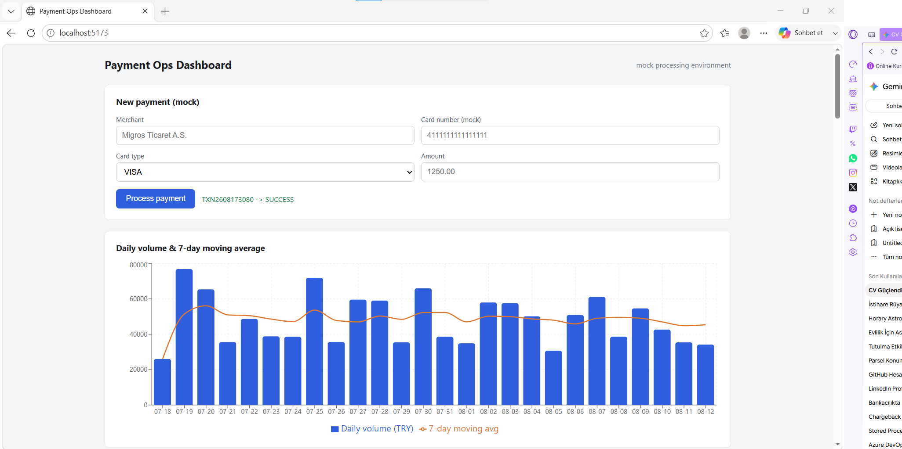
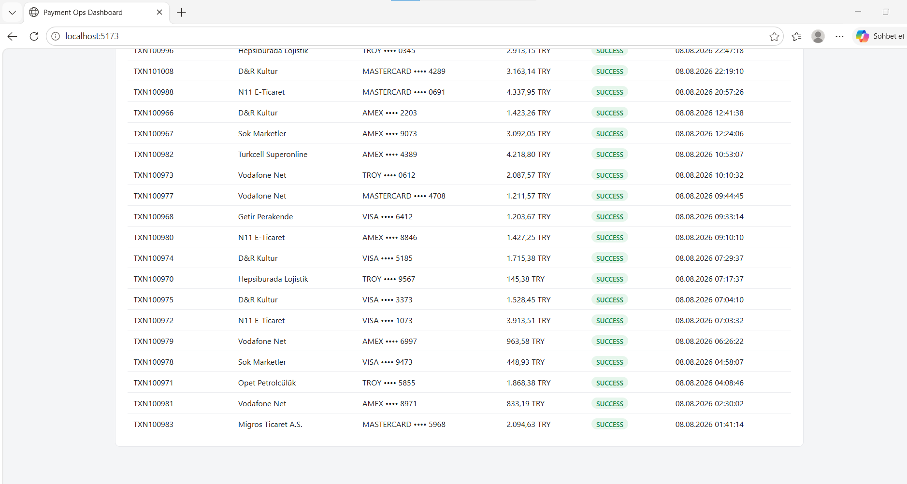

# Corporate Payment System (Mock Processing Environment)

A full-stack payment operations dashboard designed for tracking real-time transaction volumes, monitoring payment statuses, and calculating 7-day moving averages. 

## 📸 Dashboard Overview

| Dashboard & Charts | Recent Transactions |
|:---:|:---:|
|  |  |

## 🚀 Tech Stack

**Frontend:**
* React.js
* JavaScript, HTML, CSS
* Recharts (for data visualization)
* Vite

**Backend & Database:**
* .NET 8 (C#) Web API
* Dapper (Micro-ORM)
* MS SQL Server (T-SQL)

## 💡 Key Features

* **Real-time Charting:** Visualizes daily payment volumes and 7-day moving averages.
* **Transaction Management:** Displays recent corporate transactions (SUCCESS, FAILED, PENDING, REFUNDED) with detailed status reasons.
* **Mock Payment Processing:** Simulates incoming transactions from various merchants.
* **High-Performance Data Access:** Utilizes Dapper for lightweight and rapid database querying.

## ⚙️ Local Setup

1. **Database:** Execute the SQL scripts located in the `/database` folder on your local MS SQL Server instance to create the schema and seed data.
2. **Backend:** Navigate to `/backend/PaymentSystem.Api` and run `dotnet run`. The API will start on `http://localhost:5000`.
3. **Frontend:** Navigate to `/frontend/payment-dashboard`, install dependencies using `npm install`, and run `npm run dev`.